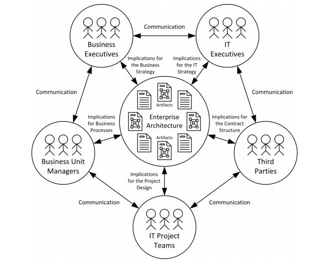
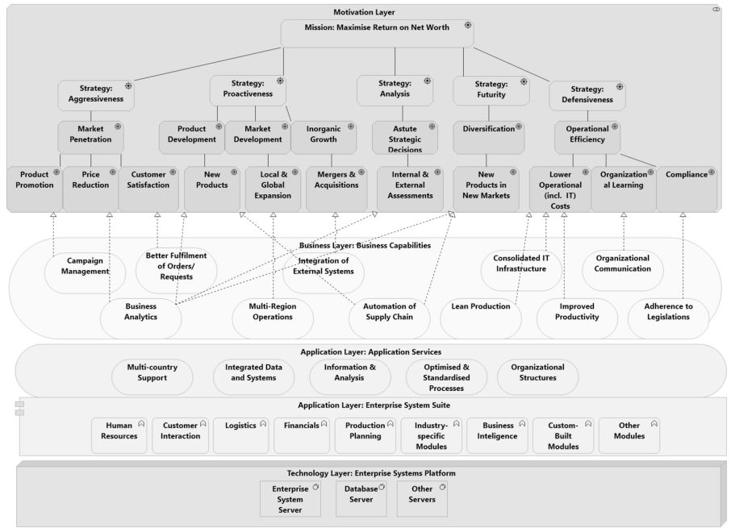
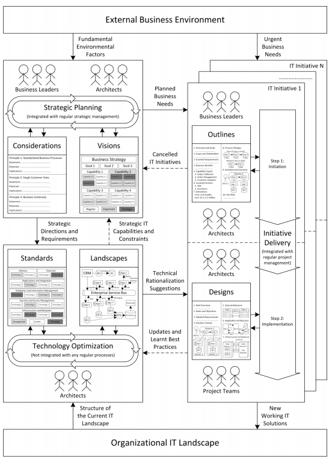
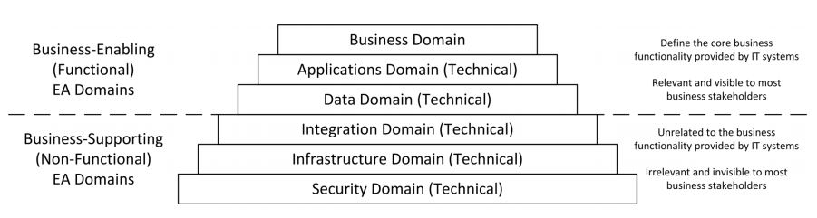
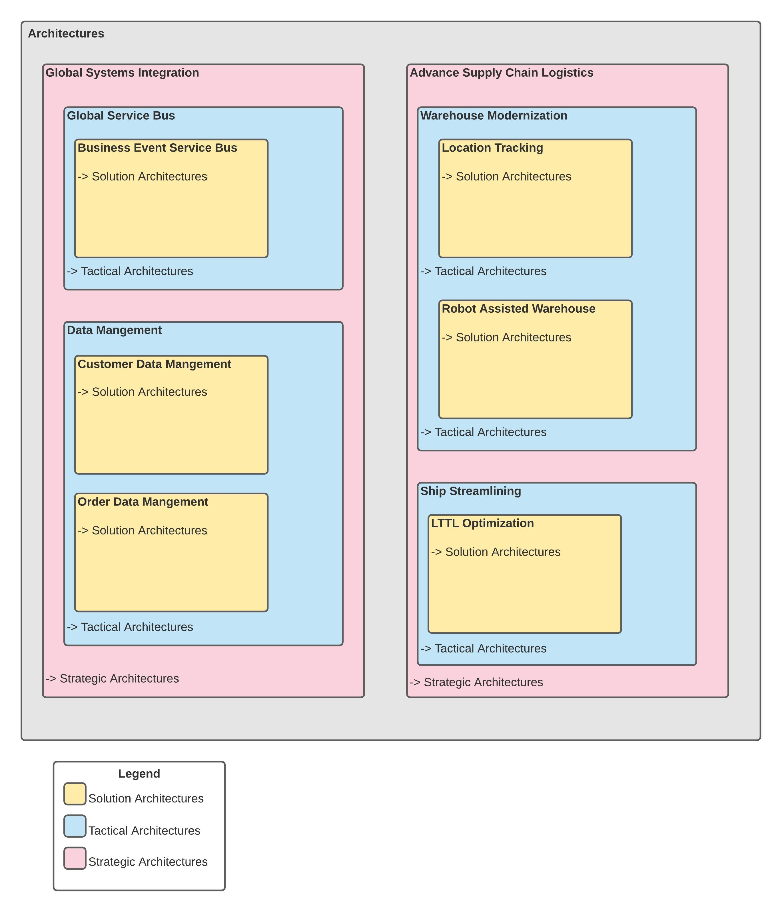
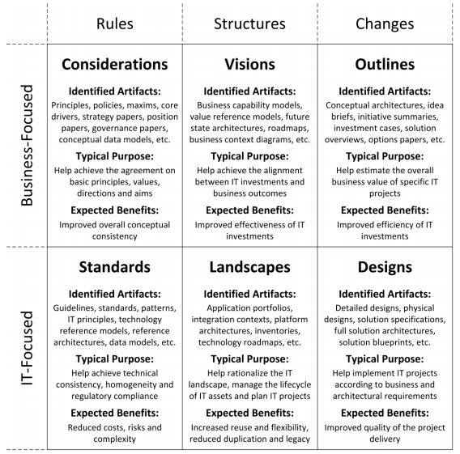
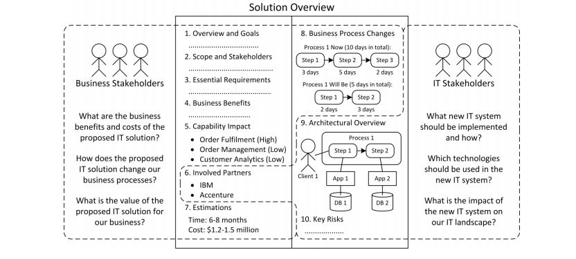
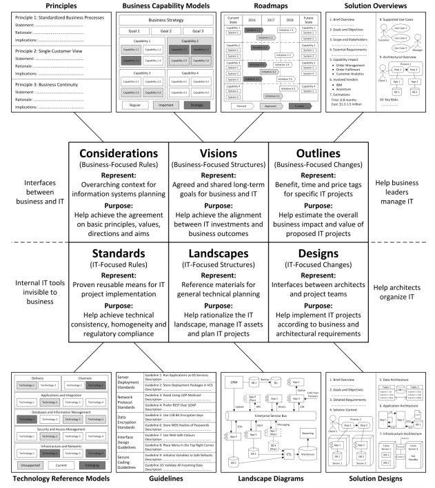
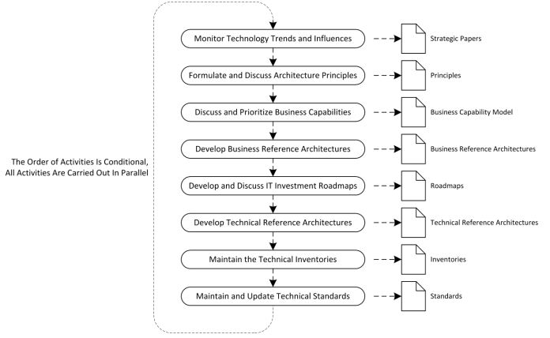
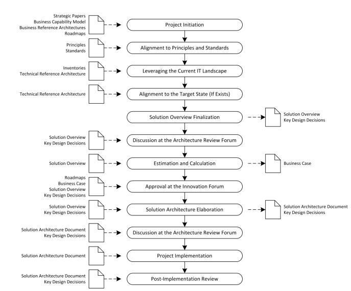

 **_(Work in progress)_**
 

# Enterprise Architecture (EA)
A blueprint for the optimal and target-conformant placement of resources in the IT environment for the ultimate support of the business function.

 * Connects the business & IT strategy
   * Look at oranization & technology
   * Shares the same story, but in different way
   * Understands each area objectives and constraints
 * Drives change
 * Affects all development of the company
 * Works with high-level abstractions of the created systems
 * Provides technical communications throughout the company
 * Design internet scale systems
 * Focuses on the business component
 * Conquer complexity
 * Has a broad technological horizon
 * Owns several domains
 * Explains and demystify
 * Remove Friction

Or in other words, a collection of special documents (artifacts) describing various aspects of an organization from an integrated business and IT perspective intended to bridge the communication gap between business and IT stakeholders, facilitate information systems planning and thereby improve business and IT alignment.

 
 # Why invest in Enterprise Architecture?

For many companies, the Enterprise Architecture is an afterthought, something only relevant to the architect who needs to give his or her sign-off during product feasibility meetings. The EA needs a seat at the table throughout the process to share guidelines and strategies with product development and IT teams that enable key growth levers. Among the reasons a clear EA is essential:

* It can provide a consistent experience, both from an employee and customer perspective. Designing an end-to-end enterprise architecture enables omnichannel integration, which can be translated into a more seamless customer journey.
* It enables the use of new technologies and simplifies integration. A well defined enterprise architecture streamlines the process for introducing cloud, automation, and the use of APIs, among other technologies. It helps drive a common platform and infrastructure that development teams can use to create products and services aligned to business objectives.
* It enables agility and flexibility to functions that use data to inform their decision-making. By aligning the data generated by the company and the tools used to collect that data, it becomes easier to automatically join, clean, and share data sets that enable supply chain, marketing, and operations teams to make decisions aligned to business goals.

# EA as an Instrument for Communication

# Strategic Alignment
If there's one constant in a fast-changing business environment it's that we need to stay innovative and nimble. If we want to achieve the best business outcomes the way to do this is to make sure everyone involved is working towards a common goal. This is especially true when it comes to alignment between IT and the business. What I mean by this is that, the IT person understands enough about the business goal and the business person understands enough about the technology to have a meaningful discussion about how they jointly achieve the desired business outcomes. If we focus on this type of collaboration we will find ourselves working smarter not harder.

One of the most important things we can do to achieve optimal IT and business alignment is be clear about the decision making process understanding that its business outcomes which should drive technology decisions not the other way around. Expecting technology partners however good they are to decide what capabilities need to be developed doesn't work on the flipside having the business dictate how they need to be developed isn't the best strategy either. Instead IT teams and business leaders need to collaborate in order to design effective business solutions powered by first-class technology. You also can not wait around until the perfect technology platform or solution is developed. You have to be willing to think quickly move nimbly and iterate collaboratively to solve problems on the fly get to market early and often should be a rallying call the best way to ensure effective collaboration is by bringing your business and IT professionals together in the same place by co-locating these groups. You can ensure everyone involved understands both the strategic business goals as well as the technology considerations. Think about the FinTech startup in the garage why do they have that energy that's spark the energy comes from colocation right people right place right results unless you're a close to this it may sound pretty obvious or the way it's always been done not so what makes this new is the partnership aspect. Traditionally the business would develop their requirements throw it over the wall to the IT design group would then throw it over the wall to the tech developers. By the time it came back it was like a game of Chinese whispers maybe you've got what you wanted but just as often you've got something completely different because something got lost in translation. The approach today having our technology and business teams sitting together working together creating together is increasingly streamlined and cohesive. Allowing us to innovate faster and deliver more effectively. It's how we create the energy that delivers the best results for our business and for our clients ultimately the driving forces behind this closer partnership. Our intellectual curiosity and mutual respect both the IT and business groups need to have a genuine interest in understanding how things are done by one another, and have a mutual respect for each other skill and dedication and professionalism at the end of the day if we think like a team and work as a team we will achieve like a high-performing team and everybody wins.

This model intends to explain how strategic alignment can be achieved using Enterprise Systems (as a dominant form of IT) through the lens of an Enterprise Architecture.

This model does not intend to depict the entire Enterprise Architecture of all, or even any single organization(s). Instead, it attempts to depict a visual and high level model explaining alignment between business strategy and IT (and specifically Enterprise Systems) through the lens of an Enterprise Architecture. So, while there could be different types and components of IT in an organization, this model only depicts the kind of IT for demonstrating strategic alignment of business and it can be achieved by traversing through these different layers.

The model is explained by breaking it down into its constituent layers namely technology layer, applications layer,
business layer and motivation layer. 

## The Technology Layer 
The technology layer, shown as a single level layer (TL1) shows the deployment of technology (specifically IT) that an organization has in place as a part of their IT platform. However, we limit our interest to the one node i.e. Enterprise System Platform. Enterprise Systems are used as the chosen type of IT.
Enterprise Systems (ES) can be defined as large-scale, packaged, application software systems. These systems come in different forms, but the most dominant forms are the Enterprise Resource Planning (ERP), Customer Relationship Management (CRM). As shown in the technology layer, Enterprise Systems are usually deployed with an application server that manages the software and an independent database server. This form of technological deployment of Enterprise Systems is widely witnessed irrespective of the vendor and the system.

## The Applications Layer
The applications layer shows the IT applications that an organization has in place as a part of their IT portfolio and the services that it provides to them. The application layer is shown to consist of two levels: the application systems level (AL1) and the application services level (AL2). Irrespective of the vendor and the system, most Enterprise
Systems are composed of in-built functional units called ‘modules’ that interact with each other to provide all the functionality. As shown in the applications layer, Such modules include Financials, Human Resources, Sales and Distribution, Materials Management, Production Planning and many others. Additional modules are available for specific industries like banking, Retail, Education, Mining and many others.
The top part of the applications layer shows the different application services that are offered by the application(s) – in this case the Enterprise System. These application services offered are the provisions or capabilities that are realized by implementing and using Enterprise systems. It may be noted here that these application services will be
realized upon (a) successful implementation (via one or more projects) and (b) effective use of the Enterprise System. 
* Integration Data and Systems: Enterprise Systems provides the capability to unify and harmonize data and systems with an organization’s unique environment, and use the systems to better connect organizational units and processes, as well as customers and suppliers.
* Optimised and Standardized Processes: Enterprise Systems provides the standardization of processes using best practices embodied in the software, and shape processes to fit the unique or strategic needs of the business.
* Information and Analytics: Enterprise Systems also provides information in real-time and transforms data into context-rich knowledge that supports the unique business analysis and decision-making needs of multiple work forces.
* Multi-Country Support: Enterprise systems have built-in support for multiple currencies, multiple languages, and multiple global locations of business.
* Organizational Structures: Enterprise Systems support the setting up of organizational hierarchies and structures in a uniform and standardized way across the entire organization. This ranges from the corporate level (headquarters and branches) to business unit levels, and also include multi- entity organizations (holding and subsidiaries). 

## The Business Layer
This layer, in a single level (BL1), shows the capabilities that the technology layers helps to build in the organization, that may contribute towards meeting its objectives, goals and mission. These capabilities include (but not limited to):
* Better Fulfilment of Orders/Requests: Timely and accurate fulfilment of orders and service requests through faster, accurate and integrated transaction processing enabled by Enterprise Systems
* Lean Production: Reduction in inventory carried due to better production planning enabled by the optimized processes in the Enterprise System
* Automation of Supply Chain: Linking supply chain partners like suppliers, wholesalers, retailers etc. using the Enterprise System’s integration tools
* Organizational Communication: Co-ordination between business units through standardized processes and user interfaces of the Enterprise System 
* Consolidated IT Infrastructure: Common infrastructure through integration and standardization of IT components in the form of the Enterprise System
* Business Analytics: Analysis of the organization’s operations finances, customers, suppliers and other stakeholders enabled by the real-time information and analytical tools provided by Enterprise Systems
* Integration of External Systems: integrating other systems quickly and easily into the already integrated Enterprise System 
* Compliance: Adherence with legislations, like the Sarbanes-Oxley Act with the built-in support for such laws in Enterprise Systems.

## The Motivation Layer
This layer presents the topmost layer of the organization: the ‘ends’ that organizations wish to achieve and the ‘means’ through which they can achieve those ‘ends’. In other words, the ‘motivations’ for the organizations to exist.
At the top of the hierarchy is the mission of business organizations: maximizing the benefits/returns of the owners/shareholders of the business. A key measure for this is the Return on Equity (RoE), also called Return on Net Worth (RoNW) and has been widely used as the ‘end’ for any business organization. Return on Equity is the amount of net income returned as a percentage of shareholders’ equity. It measures a corporation's profitability by revealing how much profit a company generates with the money shareholders have invested. This measure which is calculated as pre-tax income divided by equity. Thus ‘Maximising Return on Net Worth’ is shown at the topmost level (ML0) of the motivation layer in the model; this can be taken to be the ultimate ‘end’ for any business organization.

The next level (ML1) shows that to achieve this ultimate ‘end’, different organizations employ different ‘means’. These different means can be well and comprehensively depicted by a widely cited framework called the Strategic Orientation of Business Enterprises (STROBE). This framework suggests that business organizations choose one or more of the six ‘strategic orientations’ to achieve their end goal. These six strategic orientations are: Aggressiveness, Proactiveness, Defensiveness, Analysis, Futurity and Riskiness. 
* Aggressiveness: It is the strategic orientation in which the organization aims to improve its existing market share and outperform competitors.
* Proactiveness: It is the strategic orientation in which organization searches for new market opportunities and business ventures as well as new products and services that can be offered.
* Defensiveness: It is the strategic orientation in which an organization engages in activities to improve its efficiency and reducing the costs of business operations in an effort to preserve its prospective domain.
* Futurity/Riskiness: It is the strategic orientation in which an organization’s decisions or activities reflect long-term considerations. These often tend to be venturing into new high risk areas based on future predictions.
* Analysis: It is the strategic orientation in which an organization takes actions based on factual, comprehensive information for decision-making through detailed root-cause analyses and potential solutions.

The next level (ML2) shows how the different strategic orientations mentioned in the above level can be translated in the form of different high level ‘goals’.
* In Agressiveness, the main goal is to achieve Market Penetration.
   *  Market Penetration: this means that the organization aims to increase its revenue using its existing offerings (products and services) in existing markets.
* In Proactiveness, the main goals are to achieve Product Development, Market Development and Inorganic Growth.
   * Product Development: this means that an organization aims to increase its revenue by creating new products and services targeted at its existing markets.
   * Market Development: this means that an organization aims to increase its revenue by expanding into new markets (customer segments, geographies, countries etc.) using its existing offerings.
   * Inorganic Growth: this means that an organization aims to increase its revenue by acquiring or merging with other organizations.
* In Defensiveness, the main goal is to achieve Operational Efficiency
   * Operational Efficiency: this means that an organization aims to reduce costs by improving productivity and efficiency of its operational and administrational activities
* In Futurity, the main goal is to achieve Diversification
   * Diversification: this means that an organization aims to increase revenue by introducing new offerings in new markets. It is the riskiest strategy because both product and market development is required.
* In Analysis, the main goal is to make Astute Strategic Decisions
   * Astute Strategic Decisions: this means that an organization aims to make ‘intentional choices or programmed responses about issues that materially affect the survival prospects, well-being and nature of the organization

# Types of IT Initiatives
## Fundamentals
## Stategic

## The Process View in Practice
This figure provides an aggregated view of the core processes constituting an EA practice with their interrelationships and most essential properties, including their main goals and motives, necessary participants, underlying EA artifacts and documents, key activities and associated techniques, temporal nature and general meaning

This figure suggests, an EA practive cannot be viewed as a single step-by-step process, where architects creates numerious EA artifacts to describe all the layers of architecture from busienss to infrastructure, but rather as a complex set of diverse and interacting processes happening simultaneously organizational levels.

As a mediator between strategic management and projects management, an EA practice enables effective coordination of plans and activities between all relevant actors involved in strategic decision-making and implementation of IT systems resulting in improved business and IT alignment

### External Businesss Enviroment
Economy, technology, society, demography, legislation, regulation, competitors, partners, suppliers, customers, etc.

### Organizational IT Landscape
Existing applications, information systems, databases, integration platforms, network and server infrastructure, etc.

### Strategic Planning 
Strategic planning process alone neither delivers any IT solutions nor even describes what exactly needs to be delivered, but only provides high-level rules and directions for IT reflected in Considerations and Visions agreed by both business and IT.

_Goal_: Articulate the desired future course of action for business & IT

_Question_: How is the business enviorment changing & what should we do to react to these changes?

_Focus_: Long-term & mid-term future

_Instance_: Single, or several in high decentralized organizations, e.g. one instance for each line of business

_Nature_: Continuous & loargely unstructured

_Integration_: Integrated with regular strategic management activities, e.g. environmental analysis, identification of competitive advantages and goals formulation

_Timing_: Aliged to the annual business planning cycle, important business dates, periods & events, e.g. fiscal years, budgeting cycle, board meeetings or updates of a business strategy

_Actors_: Business Leaders & Architects

_EA Artifacts_: Considerations & Visions, e.g. principles, policies, business capability models, & roadmaps

_Other Documents_: Organizational mission & values, strategic goals, objectives, & KPIs, balanced scorecards and strategy maps, buiness motivation models, high-level strategic business plans and more detailed programs of work

_Content_: Development of rules and directions for business and IT and their explicit documentation in Considerations and Visions

_Activities_: Informal discussions, meetings, presentations, and workshops, as well as periodical formal approvals and sign-off

_Techniques_: SWOT & PEST analyses, Five Forces and other strategy frameworks

_Inputs_: Fundamental factors of the external business environment

_Output_: High-level strategic plans for business & IT reflected in Considerations and Visions

_Meaning_: Strategy-to-portfolio, i.e. convert an abstract business strategy into more specific suggestions regarding the desired portfolio of IT inventments

### Technology Optimization
_Goal_: Improve the overall quality of the corporate IT landscape

_Question_: What is wrong with the current IT landscape and what should we do to improve it?

_Focus_: Current situation with some future outlook

_Instances_: Single, or several in highly decentralized organizations, e.g. one instance for each busines division

_Nature_: Continous and largely unstructured

_Timing_: May be carried out indepedently without any systematic schedule, often on an as-necessary basis or event opportunisically, e.g. in the absence of other higher-priority activities

_Actors_: Architects alone

_EA Artifacts_: Standards & Landscapes, e.g. Technology Reference Models, Guildlines, Landscape Diagrams, and Inventories

_Other Documents_: None

_Content_: Analysis of the existing IT landscape, update of Standards, maintenance of Landscape and formulation of rationalization proposals

_Activities_: Numerous informal discussions and periodical formal approvals

_Techniques_: Total cost of ownership (TCO) and architecture debt management

_Inputs_: Current struture of the organizational IT landscape

_Outputs_: Technical reationalization suggestions reflected in Standards and Landscapes

_Meaning_: Structure-to-rationalization, i.e. understand the current structure of the IT landscape and formulate the rationalization strategy its future evolution

### Initiative Delivery
Is the next downstream process which turns the abstract plans into tangible IT solutions implemented in an optimal manner. It closes the gap between Strategic planning and the actual practical implementation of working IT solutions.

_Goal_: Deliver optimal IT solutions for specific needs

_Question_: What is the best way to adddress the requested need and all the associated requirements?

_Focus_: Short-term & immediate future

_Instances_: Multiple, one instance for each active IT initiative, e.g. project or program

_Nature_: Sequential with two inherent steps: Initiation & Implementation

_Integration_: Integrated with regular project and program mangement activities, e.g. scoping, estimating, scheduling, resourcing, and monitoring

_Timing_: Linked to the established initiative delivery phases and gates, e.g. scope, evaluate, plan, build, test, and deploy

#### Step 1: Initiation
_Actors_: Business Leaders & Architects

_EA Artifacts_: Outlines, e.g. Solutions Overviews and Options Assessments

_Other Documents_: Business proposals and business cases

_Content_: Analysis of possible solution implementation options, their explicit documentation in Outlinesand offical endorsement

_Activities_: Frequent discussions, presentations and approvals

_Techniques_: Business process modeling, customer journey mapping, return-on-investment (ROI) and architecture debt estimation
------END of Step 1

#### Step 2: Implementation
_Actors_: Architects & Project Teams
_EA Artifacts_: Designs, e.g. Solution Designs and Preliminary Solution Design
_Other Documents_: Business requirements and project management plans
_Content_: Development of designs based on Outlines and then their actual technical implementation
_Activities_: Daily collaborative work
_Techniques_: User stories, requirements traceability matrices and (MoSCoW prioritization)[https://www.productplan.com/glossary/moscow-prioritization/] framework
------END of Step 2

_Inputs_: Specific business, and sometimes technical, needs

_Outputs_: New working IT solutions

_Meaning_: Need-to-solution, i.e. convert a specific need into a concrete IT solution addressing this need in the most optimal manner

# The Concept of Enterprise Architecture

# Domains of Enterprise Architecture
The informational contents of enterprise architecture typically encompass the following common EA domains:
* Business domain – covers customers, capabilities, processes, roles, etc.
* Applications domain – covers programs, systems, custom software, vendor products, etc.
* Data domain – covers data entities, structures, sources, etc.
* Integration domain – covers interfaces, connections, interaction protocols, integration platforms, etc.
* Infrastructure domain – covers hardware, servers, operating systems, networks, etc.
* Security domain – covers firewalls, authentication mechanisms, identity and access management systems, encryption, etc.

Generally, enterprise architecture can describe any domains considered as important from the perspective of the relationship between business and IT

# EA Domains as a Stack
The set of common EA domains can be represented as a multilayered stack of domains, where lower layers underpin higher layers:
* Applications automate business processes
* Data is used by applications
* Integration mechanisms link all applications and data together
* Infrastructure hosts all applications, databases and integration platforms
* Security mechanisms permeate all other EA domains

The business domain is non-technical in nature, while all other EA domains are technical domains directly related to respective technologies

# Enabling and Supporting EA Domains
All EA domains can be also separated into business enabling domains and business-supporting domains
* Business-enabling EA domains occupy the top layers of the stack and represent functional domains
* These domains are relevant to business stakeholders and define the core business functionality of IT systems
* Business-supporting EA domains occupy the bottom layers of the stack and represent non-functional domains
* These domains are irrelevant to business stakeholders and unrelated to business functionality of IT systems

# Levels of Enterprise Architecture.
Enterprise Architect has a number of powerful features that will assist the architecture program to partition and maintain these levels of the architecture and their inter-relationships.

 * **Strategic Architectures**: Provides a high level and often long term view of the enterprise and are used by senior business and technical stackholders to get a single view of the architecture to assist with strategic planning.
 * **Tactical Architectures**: Provide a mid-range view of the enterprise often focused on a particular area or division and provides the context for operational changes and equates to the portfolio or program level organization of projects and initiatives.
 * **Solution Architectures**: Provide a detailed view of how an enterprise can support a capability and how the parts of the architecture can be used to describe baseline and target capabilites and capability increments. These architectures will typically guilde projects that are grouped within a portfolio.

Enterprise Architect can be used to define and manage strategic level architectures and can also help to ensure tactical and solution architectures are aligned to support the strategic direction. 

This diagram shows the way architecture at different levels can be visualized.

# The Role of Enterprise Architecture Practice

# Four Stages of Architecture Maturity
  1. **Business Silios**: where companies look to maximize individual business unit needs or functional needs.
  2. **Standardized Technology**: providing IT efficientcies through technology standardization and, in most cases, increased centralization of technology management.
  3. **Optimized Core**: which provides companywide data & process standardization as appropriate for the operating model.
  4. **Business Modularity**: where companies manage and reuse loosely IT-enabled business process components to preserve global standards while enable local differences.

 ## Local
 ## Urgent
 ## Architectural

# Types Of Enterprise Architecture Artifacts

## Example of a Duel EA Artifact

This solution overview helps business and IT stakeholders make optimal collective planning decisions regarding the launch of a new IT initiative

## Considerations 
are Business-Focused Rules. EA artifacts related to this general type identified in organizations include principles, policies, maxims, core drivers, architecture strategies, conceptual data models, governance papers, position papers, strategy papers and whitepapers. All these EA artifacts describe global conceptual rules and considerations important for business and relevant for IT. Considerations are developed collaboratively by senior business leaders and architects and then used to influence all architectural decisions. Their purpose is to help achieve the agreement on basic principles, values, directions and aims. The proper use of Considerations leads to improved overall conceptual consistency.
## Standards
are IT-Focused Rules. EA artifacts related to this general type identified in organizations include guidelines, standards, patterns, IT principles, data models and reference
architectures as well as technology, application, infrastructure, platform and security reference models. All these EA artifacts describe global technical rules, standards, patterns and best practices relevant for IT systems. Standards are developed by architects and technical subject-matter experts and then used to influence architectures of all IT projects. Their purpose is to help achieve technical consistency, technological homogeneity and regulatory compliance. The proper use of Standards leads to reduced costs, risks and complexity.
## Visions 
are Business-Focused Structures. EA artifacts related to this general type identified in organizations include business capability models, value reference models, business context diagrams, business reference architectures, business activity models, enterprise process maps, future state architectures and all sorts of roadmaps. All these EA artifacts provide high-level conceptual descriptions of the organization from the business perspective. Visions are developed collaboratively by senior business leaders and architects and then used to guide and prioritize all IT initiatives. Their purpose is to help achieve the alignment between IT investments and business outcomes. The proper use of Visions leads to improved effectiveness of IT investments.
## Landscapes 
are IT-Focused Structures. EA artifacts related to this general type identified in organizations include platform architectures, relational diagrams, application portfolios, integration contexts, system interaction diagrams, inventories, asset registers, IT systems value maps, one page diagrams, enterprise technology models and all sorts of technology roadmaps. All these EA artifacts provide high-level technical descriptions of the organizational IT landscape. Landscapes are developed and maintained by architects and used to support technical decision-making and facilitate project planning. Their purpose is to help rationalize the IT landscape, manage the lifecycle of IT assets and plan IT projects. The proper use of Landscapes leads to increased reuse and flexibility, reduced duplication and legacy.
## Outlines 
are Business-Focused Changes. EA artifacts related to this general type identified in organizations include conceptual architectures, solution overviews, conceptual designs, solution briefs, preliminary solution architectures, solution outlines, idea briefs, solution proposals, initiative summaries, investment cases, options papers and solution assessments. All these EA artifacts provide high-level descriptions of specific IT projects understandable to business leaders. Outlines are developed collaboratively by architects and business leaders and then used to evaluate, approve and fund specific IT projects. Their purpose is to help estimate the overall business value of specific IT projects. The proper use of Outlines leads to improved efficiency of IT investments.
## Designs 
are IT-Focused Changes. EA artifacts related to this general type identified in organizations include detailed designs, solution definitions, full solution architectures, highlevel designs, solution specifications, integrated solution designs, physical designs, solution blueprints and technical designs. All these EA artifacts provide detailed technical descriptions of specific IT projects actionable for project teams. Designs are developed collaboratively by architects, project teams and business representatives and then used by project teams to implement IT projects. Their purpose is to help implement IT projects according to business and architectural requirements. The proper use of Designs leads to improved quality of the project delivery.

# Eight Essential Artificats

## Principles 
Sometimes also called maxims, describe high-level policy statements having significant impact on both business and IT, for instance, that all provided services
should be available to customers via single sign-on. The list of ~10-20 principles is typically defined and then periodically reviewed collaboratively by architects and senior business leaders in order to achieve the agreement on basic rules, values, directions and aims. All business and IT decisions, as well as architectures of all IT projects, are evaluated for their compliance with established principles. Like all EA artifacts related to Considerations, principles represent the overarching context for information systems planning.
## Technology reference models (TRMs) 
Can be called technology standards or split into infrastructure, applications and other more specific reference models; provide standardized sets of available technologies to be used in all IT projects structured according to their domains, often with their lifecycle phases color-coded. TRMs are typically developed by architects and subject-matter experts in specific technologies and then updated in a periodic manner, often yearly. Architectures of all IT projects are reviewed by architects to ensure their alignment to TRMs and thereby achieve overall technological homogeneity and consistency of the IT landscape.
## Guidelines 
Often also called standards; define low-level IT-specific prescriptions or best practices to be followed in all IT projects grouped by their technology domains, for instance, that certain network protocols should be used for particular purposes or certain encryption standards should be used for particular types of data. Guidelines are typically developed and periodically updated by architects and subject-matter experts in specific areas. Architectures of all IT projects are reviewed by architects to ensure their adherence to guidelines and thereby achieve technical consistency and in some cases regulatory compliance as well. Even though both TRMs and guidelines describe some implementationlevel technical rules relevant to IT projects, they are complementary to each other because TRMs provide lists of technologies to be used, while guidelines define more narrow prescriptions regarding their usage. TRMs and guidelines are the most common EA artifacts related to the Standards general type (IT-focused rules). Like all EA artifacts related to Standards, TRMs and guidelines represent proven reusable means for IT project implementation.
## Business capability models (BCMs) 
Sometimes also called business capability maps; provide structured views (“maps”) of all organizational business capabilities on a single page, sometimes together with other supporting information like business strategy, objectives, main customers, partners, etc. BCMs are typically developed collaboratively by architects and
senior business leaders and then “heatmapped” to identify best investment opportunities, prioritize future IT spendings and ensure the alignment between IT investments and desirable business outcomes. BCMs are often considered as “entry points” into IT for business executives.
## Roadmaps 
Can be called investment roadmaps, divisional roadmaps, capability roadmaps, technology roadmaps, etc.; provide structured views of planned future IT investments with their tentative timelines aligned to different capabilities or business areas, often outlining their high-level target states after several years. They usually explain how and when “heatmapped” business capabilities will be uplifted. Roadmaps are typically developed collaboratively by architects and senior business leaders and help prioritize proposed IT initiatives, align future IT investments to business plans and initiate IT projects. Even though both BCMs and roadmaps provide some descriptions of the desired future from the business perspective, they are complementary to each other because BCMs help decide where future IT investments should go, while roadmaps help decide when these IT investments should be made. BCMs and roadmaps are definitely the most common EA artifacts related to the Visions general type (business-focused structures). Like all EA artifacts related to Visions, BCMs and roadmaps represent agreed and shared long-term goals for business and IT.
## Landscape diagrams 
Used under very diverse titles including system interaction diagrams, relational diagrams, platform architectures, one page diagrams, integration contexts, etc.; describe high-level connections between various applications, databases, platforms, systems and sometimes business processes covering large parts of the corporate IT landscape, typically in their current states. Landscape diagrams are usually maintained by architects and updated at the completion stages of all IT projects modifying the IT landscape. They help architects optimize the IT landscape and select best implementation options for new IT projects. Landscape diagrams are seemingly the most common EA artifacts related to the Landscapes general type (IT-focused structures) . Like all EA artifacts related to Landscapes, landscape diagrams represent reference materials for general technical planning.
## Solution overviews 
Can be called conceptual architectures, solution outlines, conceptual designs, preliminary solution architectures, solution briefs, etc.; describe specific IT projects in a brief business-oriented manner, usually including their high-level architectures, expected business value, estimated costs, risks and timelines. Solution overviews of ~15-30 pages long are typically developed for all proposed IT projects at their early stages collaboratively by their business sponsors and architects. They help senior business stakeholders estimate the overall business impact and value of proposed IT projects and make informed investment decisions regarding these projects. Solution overviews are definitely the most common EA artifacts related to the Outlines general type (businessfocused changes). Like all EA artifacts related to Outlines, solution overviews represent benefit, time and price tags for specific IT projects.
## Solution designs  
Can be called high-level designs, solution definitions, detailed designs, full solution architectures, project-start architectures, etc.; describe specific IT projects in a highly technical manner with all the necessary details required to implement these projects. Solution designs of ~25-50 pages long are typically developed for all approved IT projects collaboratively by architects, project teams and business representatives to reflect both business and architectural requirements. They are used by projects teams during the whole duration of IT projects and help implement these projects according to the pre-agreed requirements. Solution designs are the key EA artifacts related to the Designs general type (IT-focused changes). Like all EA artifacts related to Designs, solution designs represent communication interfaces between architects and project teams.
## Key Design Decisions (KDDs)
Are summary documents describing significant architectural decisions taken for specific IT solutions, the reasoning behind them, their justifications, and pros and cons. For instance, KDDs should explain any deviations of a solution from established principles, standards, roadmaps, or technical reference architectures. KDDs are extracted from solution overviews and SADs by solution architects and used by enterprise architects and business stakeholders as main points of discussion, review, and approval for all IT solutions

# Enterprise-Level Processes
Enterprise-level architecture processes consist of eight distinct activities of enterprise architects. These activities are largely independent of each other and can
be carried out in parallel without any particular predefined order. Therefore, they are discussed starting from more “generic” activities and ending with more “specific” ones:

1. Enterprise architects monitor relevant technology trends in the external environment, communicate with senior business stakeholders, and periodically produce strategic papers with the analysis of the possible impact and influence of these trends on the organization.
2. Enterprise architects formulate architecture principles for the whole organization and discuss them with senior business stakeholders.
3. Enterprise architects maintain the business capability model and use it for discussions with senior business stakeholders in order to understand in which capabilities the IT investments should go.
4. Enterprise architects together with senior business stakeholders develop business reference architectures for important business capabilities by means of adapting established industry best practices to the organiztion's environment.
5. For the most important business capabilities enterprise architects develop IT investment roadmaps agreed with the relevant business stakeholders.
6. Enterprise architects develop and maintain technical reference architectures for important business capabilities according to their best understanding of the business needs and direction.
7. Enterprise architects maintain the technical inventories to adequately reflect the currently available IT assets.
8. Enterprise architects together with solution architects maintain and update enterprise-wide technical standards for IT project implementation.

## Project-Level Architecture Processes

# Architecture Debt

# Architecture Roadmap
Is a lists of individual work packages that will realize the Target Architecture and lays them out on a timeline to show progression from the Baseline Architecture to the Target Architecture. The Architecture Roadmap highlights individual work packages' business value at each stage. Transition Architectures necessary to effectively realize the Target Architecture are identified as intermediate steps.

A few lessons learnt while rolling out the process:
 1. **Focus on the basics and stay grounded**: Well defined roadmaps abstract the details while highlighting significant capabilities, However, while reviewing roadmaps across an organization, Architects should examine and synch up the details.
 2. **Plan for a continuum of reviews**: Business domains evolve, strategies get updated, and new capabilities are periodically introduced in organizations. Therefore, the roadmaps will periodically become obsolete, and must be updated and reconciled.
 3. **Stakeholder engagement**: Reconciling roadmaps at a large organization does not happen in isolation. One must engage Architects and stakeholders from across functional and business boundaries which may present logistical challenges. Engaging teams that are geographically dispersed will require consulting and change management skills.  
 4. **Consultative more than directive**: A roadmap review should take into account organizational (human) dynamics and organizational constraints. The reviews and reconciliation should be consultative, although some aspects - like external vendor inputs or Technology Debt - may have to be directive.

# Reverse Engineering the Organization
|   | Cost Center | Asset | Partner | Enabler | 
| --- | --- |--- |--- |--- |
| Focus on  | Cost | Return in Investment | Business Value | Speed & Innovation | 
| Typical CIO Reporting line  | CFO | COO | CDO | CEO |
| Common Strategy  | Outsouce IT | Harmonize/Rationalize | Insource IT | IT=business | 
| Levers | Cost Cutting | Ecconomies of Scale | Agility | Economies of Speed |
